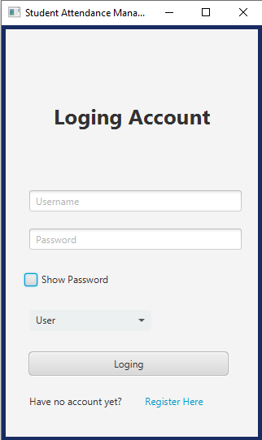
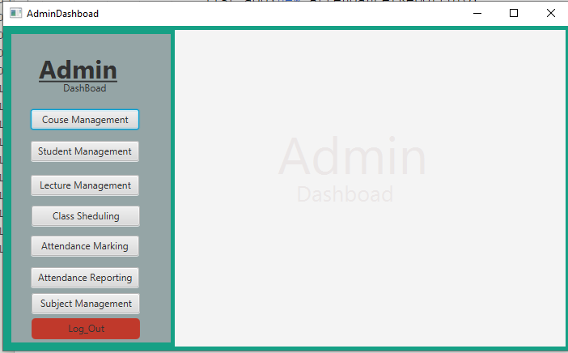
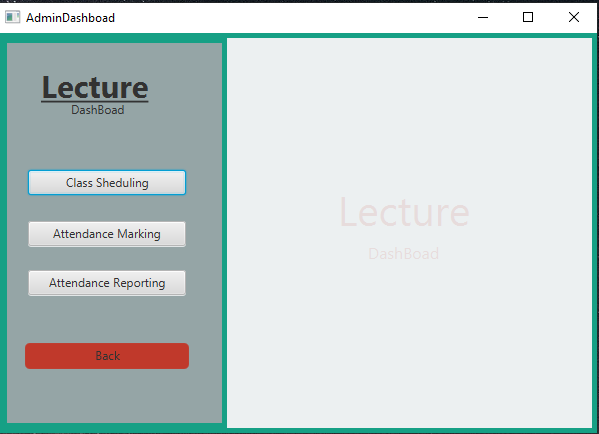
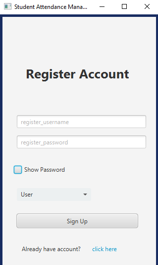

# 🎓 Student Attendance Management System

  <b>JavaFX + MySQL Desktop Application for Smart Attendance Management</b> 
  Manage Students • Lecturers • Courses • Attendance Efficiently

---

## 🚀 Overview

**SAMS (Student Attendance Management System)** is a desktop-based application built using **JavaFX and MySQL**.  
It is designed to automate and simplify attendance tracking in educational institutes with a **role-based login system**.

---

## ✨ Key Features

### 👨‍💼 Admin Dashboard
- 📚 Course Management  
- 🎓 Student Management  
- 👨‍🏫 Lecturer Management  
- 📖 Subject Management  
- 📅 Class Scheduling  
- 📊 Attendance Tracking  
- 📑 Attendance Reports  
- 🔐 Secure Authentication  

---

### 👨‍🏫 Lecturer Dashboard
- 📅 View Assigned Classes  
- 📝 Mark Student Attendance  
- 📊 View Attendance Reports  

---

## 🔐 Login Credentials

| Role      | Username | Password |
|-----------|----------|----------|
| Admin     | `1`      | `123`    |
| Lecturer  | `sineth` | `11234`  |

---

## 🛠️ Tech Stack

- ☕ Java (JavaFX)
- 🗄️ MySQL Database
- 🔌 JDBC Connectivity
- 🎨 Scene Builder
- 🧱 MVC Architecture

---

## 📸 Screenshots

### 🔐 Login Screen

  

### 👨‍💼 Admin Dashboard

  

### 👨‍🏫 Lecturer Dashboard

  

### 👨‍🏫 Register Screen

  

---

## 📌 Project Highlights

- Clean and modern JavaFX UI  
- Role-based authentication system  
- Full CRUD operations  
- Real-world attendance workflow  
- MVC architecture design  

---
